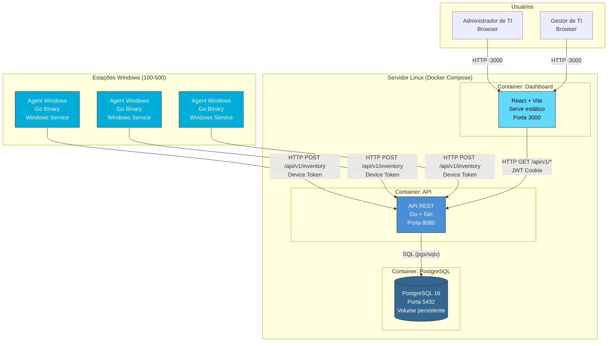
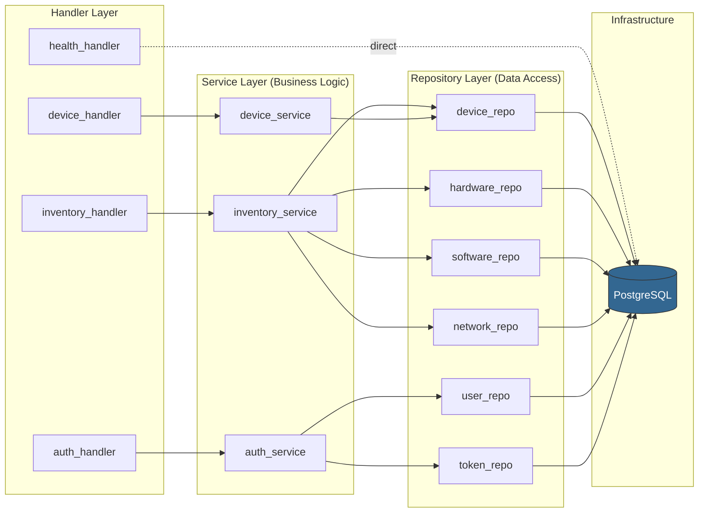
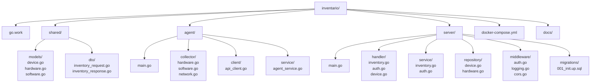

# Diagrama de Arquitetura Geral

> **Versão:** 1.0.0  
> **Data:** 2026-02-13  

---

## Arquitetura de Alto Nível — Fase 1

---

## Arquitetura Interna da API (Clean Architecture)

---

## Estrutura do Go Workspace

---

## Notas

- Toda comunicação Agent → API utiliza **HTTP** na Fase 1 (ver [Gestão de Segurança](../02-desenho-de-servico/gestao-de-seguranca.md))
- Dashboard consome apenas endpoints da API (não acessa o banco diretamente)
- PostgreSQL é acessível apenas internamente via rede Docker
- O fluxo de dependência é sempre de fora para dentro: Handler → Service → Repository

---

## Referências

- [Arquitetura da Solução](../02-desenho-de-servico/arquitetura-da-solucao.md)
- [Gestão de Configuração e Ativos](../03-transicao-de-servico/gestao-de-configuracao-e-ativos.md)
