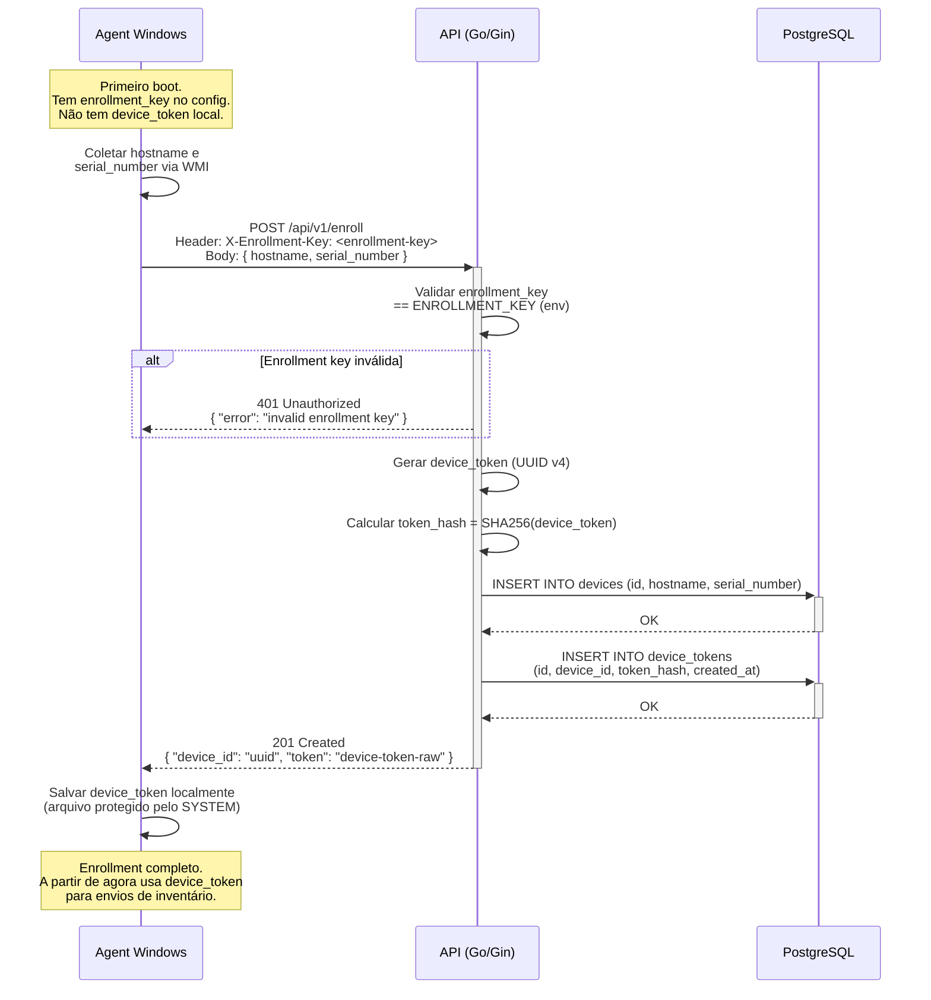
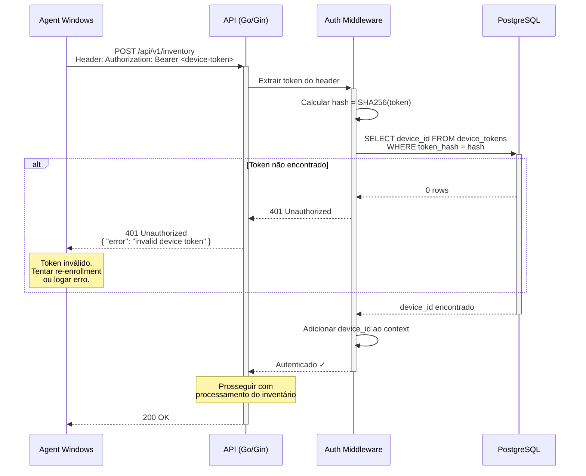
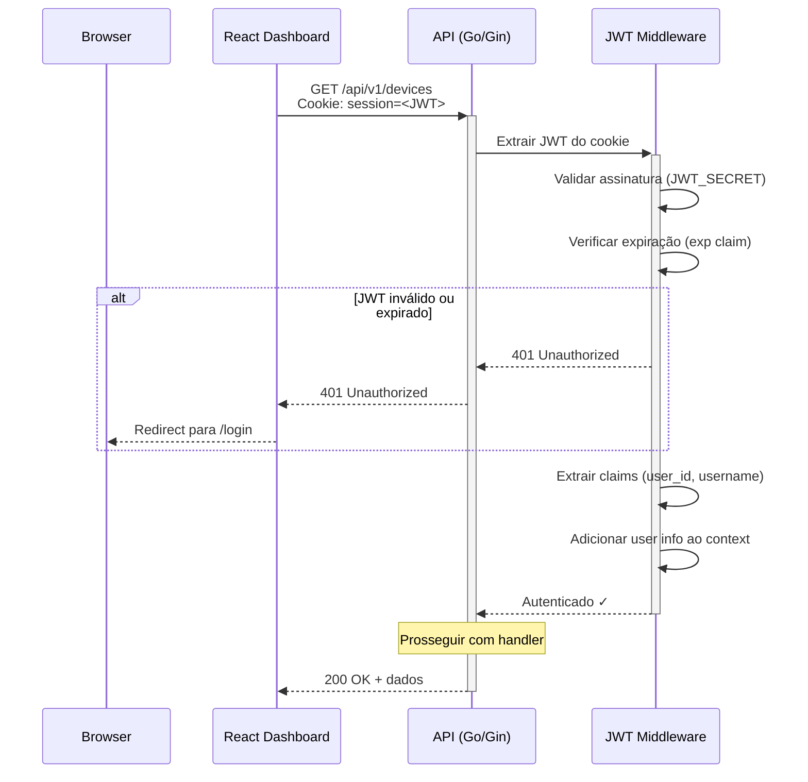

# Fluxo de Autenticação

> **Versão:** 1.0.0  
> **Data:** 2026-02-13  

---

## 1. Enrollment — Registro Inicial do Agent



---

## 2. Autenticação do Agent — Envio de Inventário



---

## 3. Login no Dashboard — JWT

```mermaid
sequenceDiagram
    participant Browser as Browser
    participant Dashboard as React Dashboard
    participant API as API (Go/Gin)
    participant DB as PostgreSQL

    Browser->>+Dashboard: Acessar /login

    Dashboard->>Dashboard: Render formulário de login

    Browser->>Dashboard: Preencher username e password

    Dashboard->>+API: POST /api/v1/auth/login<br/>Body: { "username": "admin", "password": "***" }

    API->>+DB: SELECT id, username, password_hash<br/>FROM users WHERE username = 'admin'
    
    alt Usuário não encontrado
        DB-->>API: 0 rows
        API-->>Dashboard: 401 Unauthorized<br/>{ "error": "invalid credentials" }
        Dashboard-->>Browser: Mostrar erro
    end

    DB-->>-API: User { id, username, password_hash }

    API->>API: bcrypt.Compare(password, password_hash)

    alt Senha incorreta
        API-->>Dashboard: 401 Unauthorized<br/>{ "error": "invalid credentials" }
        Dashboard-->>Browser: Mostrar erro
    end

    API->>API: Gerar JWT<br/>Claims: { sub: user_id, username, exp: +24h }<br/>Assinar com JWT_SECRET (HS256)

    API-->>-Dashboard: 200 OK<br/>Set-Cookie: session=<JWT>; HttpOnly; Path=/; SameSite=Strict; Max-Age=86400

    Note over Browser: Cookie httpOnly armazenado.<br/>Não acessível via JavaScript.

    Dashboard-->>-Browser: Redirect para /dashboard
```

---

## 4. Requisição Autenticada do Dashboard



---

## 5. Logout

```mermaid
sequenceDiagram
    participant Browser as Browser
    participant Dashboard as React Dashboard
    participant API as API (Go/Gin)

    Dashboard->>+API: POST /api/v1/auth/logout<br/>Cookie: session=<JWT>

    API-->>-Dashboard: 200 OK<br/>Set-Cookie: session=; HttpOnly; Path=/; Max-Age=0

    Note over Browser: Cookie removido.<br/>JWT não é mais enviado.

    Dashboard->>Browser: Redirect para /login
```

---

## 6. Resumo de Mecanismos de Autenticação

| Fluxo | Método | Credencial | Armazenamento | Expiração |
|---|---|---|---|---|
| **Enrollment** | Header `X-Enrollment-Key` | Enrollment key (texto) | Config file do agent | Não expira (rotação manual) |
| **Agent → API** | Header `Authorization: Bearer` | Device token | Arquivo local (SYSTEM) | Não expira (revogação manual) |
| **Login (Dashboard)** | Body POST | Username + password | — | — |
| **Dashboard → API** | Cookie `session` | JWT (HS256) | Cookie httpOnly | 24 horas |

---

## 7. Armazenamento Seguro

### Agent (Windows)

| Dado | Localização | Proteção |
|---|---|---|
| Device token | `C:\ProgramData\InventoryAgent\.token` | ACL: apenas SYSTEM |
| Enrollment key | `agent-config.yaml` | Removida após enrollment bem-sucedido |
| Config | `agent-config.yaml` | ACL: apenas SYSTEM + Admins |

### Servidor (PostgreSQL)

| Dado | Coluna | Formato |
|---|---|---|
| Device token | `device_tokens.token_hash` | SHA-256 (token raw nunca armazenado) |
| Password | `users.password_hash` | bcrypt (cost 12) |
| JWT Secret | `.env` (JWT_SECRET) | Texto (min 32 caracteres) |
| Enrollment Key | `.env` (ENROLLMENT_KEY) | Texto (min 16 caracteres) |

---

## 8. Nota de Segurança — HTTP (Fase 1)

> **⚠️ RISCO ACEITO (RISK-SEC-001):** Na Fase 1, todos os fluxos de autenticação utilizam HTTP (não HTTPS). Isso significa que tokens e credenciais trafegam em texto claro na rede. 
>
> **Mitigação:** Operação em rede local segmentada e confiável.
> 
> **Plano:** Migrar para HTTPS na Fase 2 (ver [CSI-001](../05-melhoria-continua/plano-de-melhoria.md) e [Runbook RB-011](../04-operacao-de-servico/runbooks-operacionais.md)).

---

## Referências

- [Gestão de Segurança](../02-desenho-de-servico/gestao-de-seguranca.md)
- [Fluxo de Comunicação](fluxo-de-comunicacao.md)
- [Arquitetura da Solução](../02-desenho-de-servico/arquitetura-da-solucao.md)
