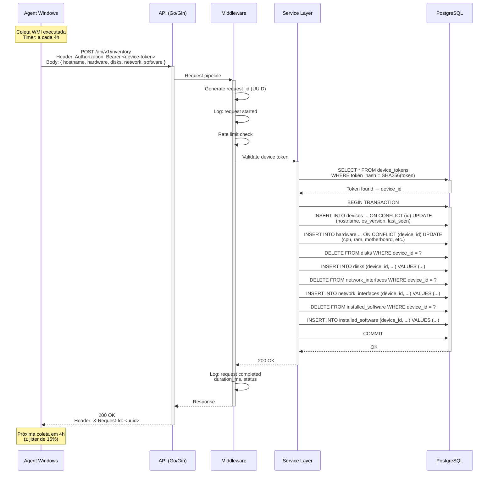
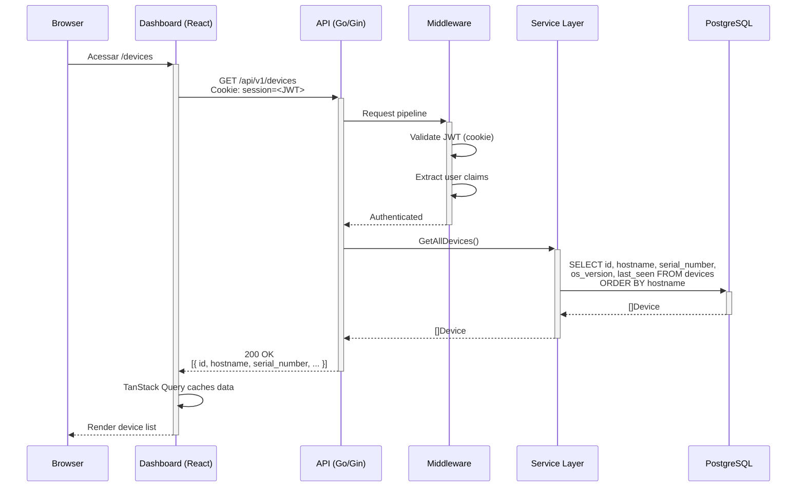
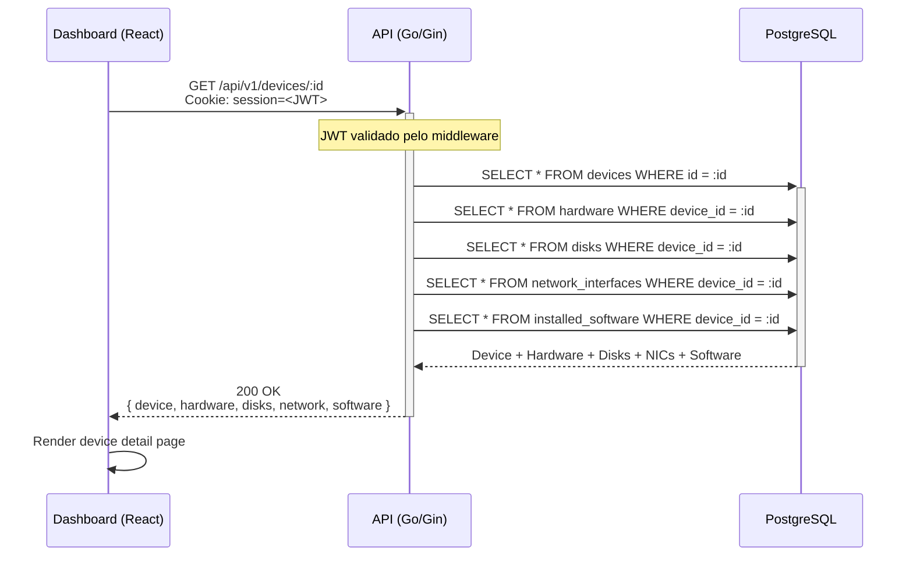
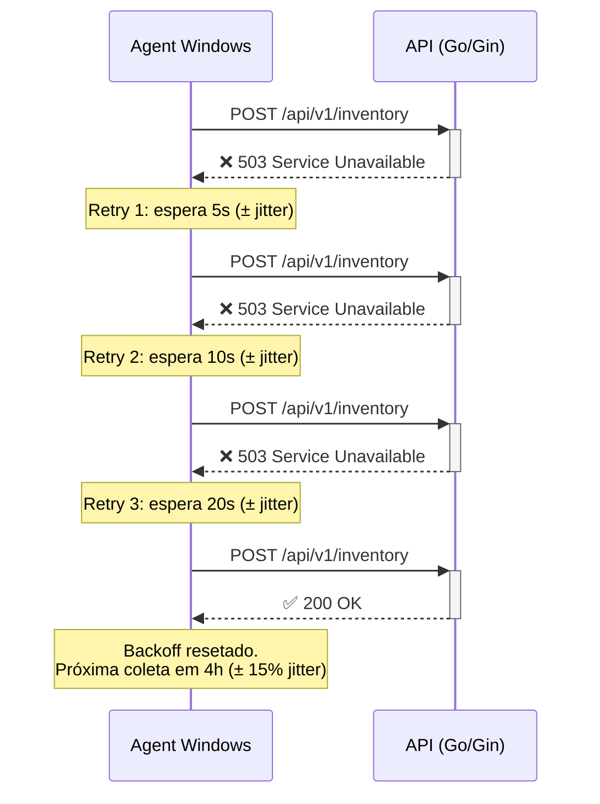

# Fluxo de Comunicação

> **Versão:** 1.0.0  
> **Data:** 2026-02-13  

---

## Fluxo Principal: Agent Envia Inventário

---

## Fluxo: Dashboard Consulta Devices

---

## Fluxo: Dashboard — Detalhe do Device

---

## Fluxo: Agent Retry com Backoff

---

## Resumo de Endpoints

| Método | Endpoint | Autenticação | Descrição |
|---|---|---|---|
| `POST` | `/api/v1/enroll` | Enrollment Key | Registrar novo agent |
| `POST` | `/api/v1/inventory` | Device Token | Enviar dados de inventário |
| `POST` | `/api/v1/auth/login` | Username/Password | Login no dashboard |
| `POST` | `/api/v1/auth/logout` | JWT Cookie | Logout do dashboard |
| `GET` | `/api/v1/devices` | JWT Cookie | Listar todos os devices |
| `GET` | `/api/v1/devices/:id` | JWT Cookie | Detalhe de um device |
| `GET` | `/healthz` | Nenhuma | Liveness check |
| `GET` | `/readyz` | Nenhuma | Readiness check |

---

## Referências

- [Arquitetura da Solução](../02-desenho-de-servico/arquitetura-da-solucao.md)
- [Fluxo de Autenticação](fluxo-de-autenticacao.md)
- [Catálogo de Serviços](../01-estrategia-de-servico/catalogo-de-servicos.md)
