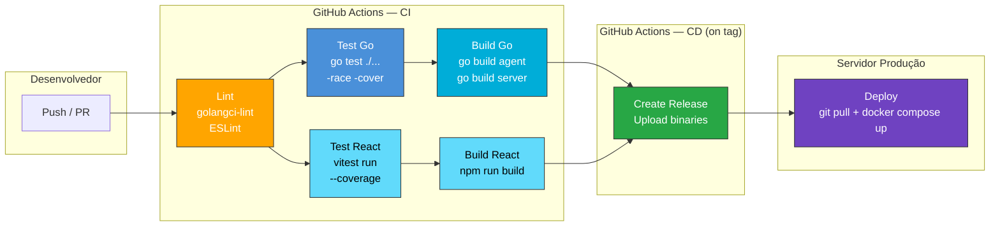
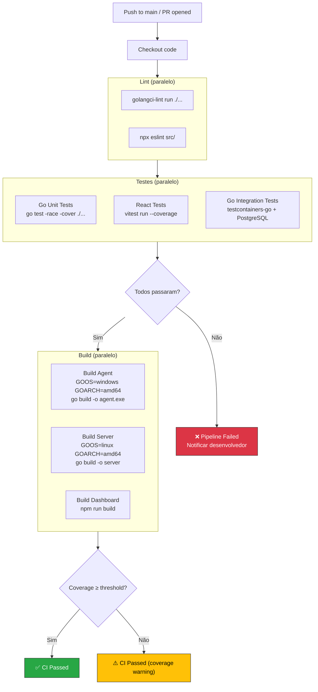
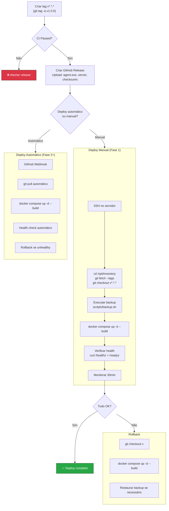
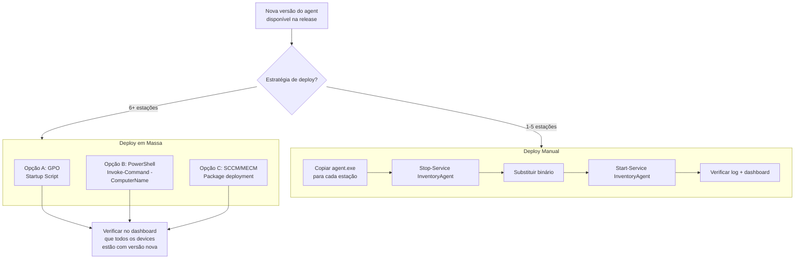

# Fluxo de Deploy (CI/CD)

> **Versão:** 1.0.0  
> **Data:** 2026-02-13  

---

## Pipeline CI/CD — Visão Geral



---

## Pipeline CI — Detalhado



---

## Pipeline CD — Deploy em Produção



---

## Deploy do Agent — Estratégias



---

## GitHub Actions Workflow — Exemplo

```yaml
# .github/workflows/ci.yml
name: CI

on:
  push:
    branches: [main]
  pull_request:
    branches: [main]

jobs:
  lint:
    runs-on: ubuntu-latest
    steps:
      - uses: actions/checkout@v4
      - uses: actions/setup-go@v5
        with:
          go-version: '1.22'
      - name: Go Lint
        uses: golangci/golangci-lint-action@v4
      - uses: actions/setup-node@v4
        with:
          node-version: '20'
      - name: React Lint
        working-directory: web
        run: npm ci && npx eslint src/

  test-go:
    runs-on: ubuntu-latest
    needs: lint
    services:
      postgres:
        image: postgres:16
        env:
          POSTGRES_USER: inventory
          POSTGRES_PASSWORD: test
          POSTGRES_DB: inventory_test
        ports: ['5432:5432']
        options: >-
          --health-cmd pg_isready
          --health-interval 10s
          --health-timeout 5s
          --health-retries 5
    steps:
      - uses: actions/checkout@v4
      - uses: actions/setup-go@v5
        with:
          go-version: '1.22'
      - name: Run tests
        run: go test -race -coverprofile=coverage.out ./...
      - name: Check coverage
        run: go tool cover -func=coverage.out

  test-react:
    runs-on: ubuntu-latest
    needs: lint
    steps:
      - uses: actions/checkout@v4
      - uses: actions/setup-node@v4
        with:
          node-version: '20'
      - working-directory: web
        run: npm ci && npx vitest run --coverage

  build:
    runs-on: ubuntu-latest
    needs: [test-go, test-react]
    steps:
      - uses: actions/checkout@v4
      - uses: actions/setup-go@v5
        with:
          go-version: '1.22'
      - name: Build Agent (Windows)
        run: GOOS=windows GOARCH=amd64 go build -o agent.exe ./agent
      - name: Build Server (Linux)
        run: GOOS=linux GOARCH=amd64 go build -o server ./server
      - uses: actions/setup-node@v4
        with:
          node-version: '20'
      - name: Build Dashboard
        working-directory: web
        run: npm ci && npm run build
```

---

## Checklist de Deploy

| # | Verificação | Comando | Esperado |
|---|---|---|---|
| 1 | CI passou | GitHub Actions | ✅ verde |
| 2 | Backup realizado | `scripts/backup.sh` | Arquivo .dump criado |
| 3 | Containers rodando | `docker compose ps` | 3 running |
| 4 | API alive | `curl /healthz` | `{"status":"ok"}` |
| 5 | DB connected | `curl /readyz` | `{"status":"ready"}` |
| 6 | Logs sem erros | `docker compose logs --tail=50 api` | Sem ERROR |
| 7 | Dashboard carrega | Browser → :3000 | Login funciona |
| 8 | Agent reporta | Dashboard → devices | last_seen atualizado |

---

## Referências

- [Gestão de Liberação e Implantação](../03-transicao-de-servico/gestao-de-liberacao-e-implantacao.md)
- [Gestão de Mudanças](../03-transicao-de-servico/gestao-de-mudancas.md)
- [Runbooks Operacionais](../04-operacao-de-servico/runbooks-operacionais.md)
