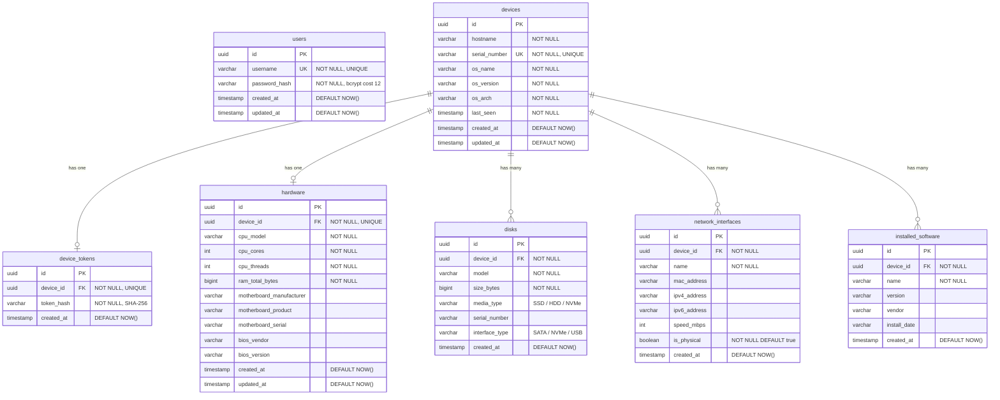

# Modelo de Dados (ER)

> **Versão:** 1.0.0  
> **Data:** 2026-02-13  

---

## Diagrama Entidade-Relacionamento



---

## Relacionamentos

| Tabela Pai | Tabela Filha | Tipo | FK | ON DELETE |
|---|---|---|---|---|
| `devices` | `device_tokens` | 1:1 | `device_tokens.device_id` | CASCADE |
| `devices` | `hardware` | 1:1 | `hardware.device_id` | CASCADE |
| `devices` | `disks` | 1:N | `disks.device_id` | CASCADE |
| `devices` | `network_interfaces` | 1:N | `network_interfaces.device_id` | CASCADE |
| `devices` | `installed_software` | 1:N | `installed_software.device_id` | CASCADE |
| — | `users` | Isolada | — | — |

---

## Índices

| Tabela | Coluna(s) | Tipo | Justificativa |
|---|---|---|---|
| `devices` | `id` | PK (btree) | Chave primária |
| `devices` | `serial_number` | UNIQUE (btree) | Busca e unicidade por serial |
| `devices` | `hostname` | btree | Busca frequente por hostname |
| `devices` | `last_seen` | btree | Filtro por devices ativos/inativos |
| `device_tokens` | `token_hash` | UNIQUE (btree) | Autenticação de agents (lookup rápido) |
| `device_tokens` | `device_id` | UNIQUE (btree) | Um token por device |
| `hardware` | `device_id` | UNIQUE (btree) | Um hardware por device |
| `disks` | `device_id` | btree | Busca de discos por device |
| `network_interfaces` | `device_id` | btree | Busca de NICs por device |
| `installed_software` | `device_id` | btree | Busca de software por device |
| `installed_software` | `(device_id, name)` | btree | Busca de software específico |
| `users` | `username` | UNIQUE (btree) | Login |

---

## Estimativas de Volume (500 devices)

| Tabela | Registros Estimados | Tamanho Estimado |
|---|---|---|
| `devices` | 500 | ~100 KB |
| `device_tokens` | 500 | ~50 KB |
| `hardware` | 500 | ~150 KB |
| `disks` | 1.000–1.500 | ~200 KB |
| `network_interfaces` | 1.500–3.000 | ~400 KB |
| `installed_software` | 50.000–150.000 | ~20–60 MB |
| `users` | 5–10 | < 1 KB |
| **Total estimado** | | **~25–65 MB** |

---

## Estratégia de Upsert (Inventário)

```sql
-- devices: upsert por id
INSERT INTO devices (id, hostname, serial_number, os_name, os_version, os_arch, last_seen)
VALUES ($1, $2, $3, $4, $5, $6, NOW())
ON CONFLICT (id) DO UPDATE SET
    hostname = EXCLUDED.hostname,
    os_name = EXCLUDED.os_name,
    os_version = EXCLUDED.os_version,
    os_arch = EXCLUDED.os_arch,
    last_seen = NOW(),
    updated_at = NOW();

-- hardware: upsert por device_id
INSERT INTO hardware (id, device_id, cpu_model, cpu_cores, ...)
VALUES ($1, $2, $3, $4, ...)
ON CONFLICT (device_id) DO UPDATE SET
    cpu_model = EXCLUDED.cpu_model,
    cpu_cores = EXCLUDED.cpu_cores,
    ...,
    updated_at = NOW();

-- disks, network_interfaces, installed_software: delete + insert
-- (mais simples e confiável para listas que mudam completamente)
DELETE FROM disks WHERE device_id = $1;
INSERT INTO disks (id, device_id, ...) VALUES ...;
```

---

## Migration Inicial

```sql
-- migrations/001_init.up.sql

CREATE EXTENSION IF NOT EXISTS "uuid-ossp";

CREATE TABLE users (
    id UUID PRIMARY KEY DEFAULT uuid_generate_v4(),
    username VARCHAR(100) NOT NULL UNIQUE,
    password_hash VARCHAR(255) NOT NULL,
    created_at TIMESTAMPTZ NOT NULL DEFAULT NOW(),
    updated_at TIMESTAMPTZ NOT NULL DEFAULT NOW()
);

CREATE TABLE devices (
    id UUID PRIMARY KEY DEFAULT uuid_generate_v4(),
    hostname VARCHAR(255) NOT NULL,
    serial_number VARCHAR(255) NOT NULL UNIQUE,
    os_name VARCHAR(100) NOT NULL,
    os_version VARCHAR(100) NOT NULL,
    os_arch VARCHAR(20) NOT NULL,
    last_seen TIMESTAMPTZ NOT NULL DEFAULT NOW(),
    created_at TIMESTAMPTZ NOT NULL DEFAULT NOW(),
    updated_at TIMESTAMPTZ NOT NULL DEFAULT NOW()
);

CREATE TABLE device_tokens (
    id UUID PRIMARY KEY DEFAULT uuid_generate_v4(),
    device_id UUID NOT NULL UNIQUE REFERENCES devices(id) ON DELETE CASCADE,
    token_hash VARCHAR(64) NOT NULL UNIQUE,
    created_at TIMESTAMPTZ NOT NULL DEFAULT NOW()
);

CREATE TABLE hardware (
    id UUID PRIMARY KEY DEFAULT uuid_generate_v4(),
    device_id UUID NOT NULL UNIQUE REFERENCES devices(id) ON DELETE CASCADE,
    cpu_model VARCHAR(255) NOT NULL,
    cpu_cores INTEGER NOT NULL,
    cpu_threads INTEGER NOT NULL,
    ram_total_bytes BIGINT NOT NULL,
    motherboard_manufacturer VARCHAR(255),
    motherboard_product VARCHAR(255),
    motherboard_serial VARCHAR(255),
    bios_vendor VARCHAR(255),
    bios_version VARCHAR(255),
    created_at TIMESTAMPTZ NOT NULL DEFAULT NOW(),
    updated_at TIMESTAMPTZ NOT NULL DEFAULT NOW()
);

CREATE TABLE disks (
    id UUID PRIMARY KEY DEFAULT uuid_generate_v4(),
    device_id UUID NOT NULL REFERENCES devices(id) ON DELETE CASCADE,
    model VARCHAR(255) NOT NULL,
    size_bytes BIGINT NOT NULL,
    media_type VARCHAR(20),
    serial_number VARCHAR(255),
    interface_type VARCHAR(20),
    created_at TIMESTAMPTZ NOT NULL DEFAULT NOW()
);

CREATE TABLE network_interfaces (
    id UUID PRIMARY KEY DEFAULT uuid_generate_v4(),
    device_id UUID NOT NULL REFERENCES devices(id) ON DELETE CASCADE,
    name VARCHAR(255) NOT NULL,
    mac_address VARCHAR(17),
    ipv4_address VARCHAR(15),
    ipv6_address VARCHAR(45),
    speed_mbps INTEGER,
    is_physical BOOLEAN NOT NULL DEFAULT true,
    created_at TIMESTAMPTZ NOT NULL DEFAULT NOW()
);

CREATE TABLE installed_software (
    id UUID PRIMARY KEY DEFAULT uuid_generate_v4(),
    device_id UUID NOT NULL REFERENCES devices(id) ON DELETE CASCADE,
    name VARCHAR(500) NOT NULL,
    version VARCHAR(100),
    vendor VARCHAR(255),
    install_date VARCHAR(20),
    created_at TIMESTAMPTZ NOT NULL DEFAULT NOW()
);

-- Índices adicionais
CREATE INDEX idx_devices_hostname ON devices(hostname);
CREATE INDEX idx_devices_last_seen ON devices(last_seen);
CREATE INDEX idx_disks_device_id ON disks(device_id);
CREATE INDEX idx_network_interfaces_device_id ON network_interfaces(device_id);
CREATE INDEX idx_installed_software_device_id ON installed_software(device_id);
CREATE INDEX idx_installed_software_device_name ON installed_software(device_id, name);
```

---

## Referências

- [Arquitetura da Solução](../02-desenho-de-servico/arquitetura-da-solucao.md)
- [Gestão de Configuração e Ativos](../03-transicao-de-servico/gestao-de-configuracao-e-ativos.md)
